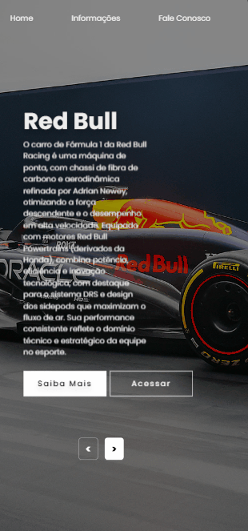

<h1 align="center">Carros F1</h1>
 

### 🚨 Sobre o Projeto

Este projeto consiste em uma landing page dedicada a alguns carros Fórmula 1, unindo design moderno e interatividade para destacar a paixão pelo automobilismo. A página foi desenvolvida utilizando HTML, CSS e JavaScript, com o objetivo de proporcionar uma experiência visualmente atraente e informativa para os visitantes. O projeto reflete minha paixão pela Fórmula 1 e demonstra meu aprendizado e habilidades no desenvolvimento front-end. Ele também serve como uma amostra prática de como combinar tecnologias da web para criar uma interface atrativa e funcional.

<strong>Link:<strong> https://joaonodari.github.io/carrosF1/

### 🔨 Ferramentas Utilizadas

* [HTML](https://developer.mozilla.org/pt-BR/docs/Web/HTML)
* [CSS](https://developer.mozilla.org/pt-BR/docs/Web/CSS)
* [JSS](https://developer.mozilla.org/pt-BR/docs/Web/JavaScript)

### 📽️ Projeto 

    </img>
    
Landing page aberta no desktop

     
     
    </img>
    
Landing page aberta no mobile

